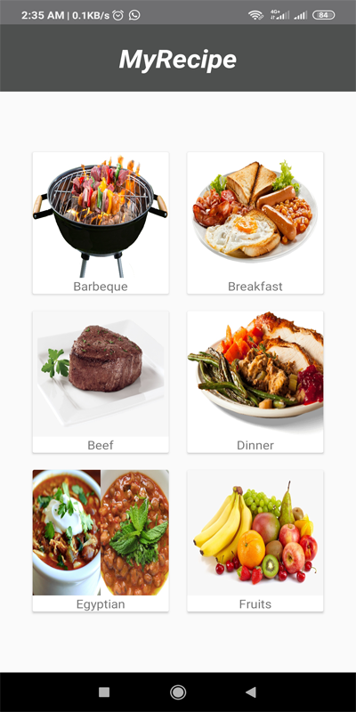
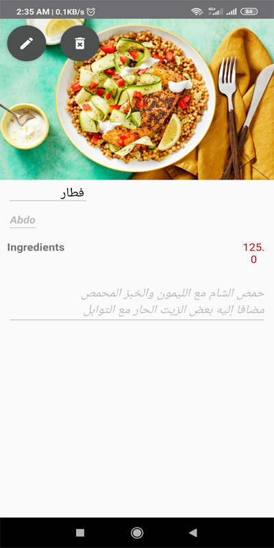
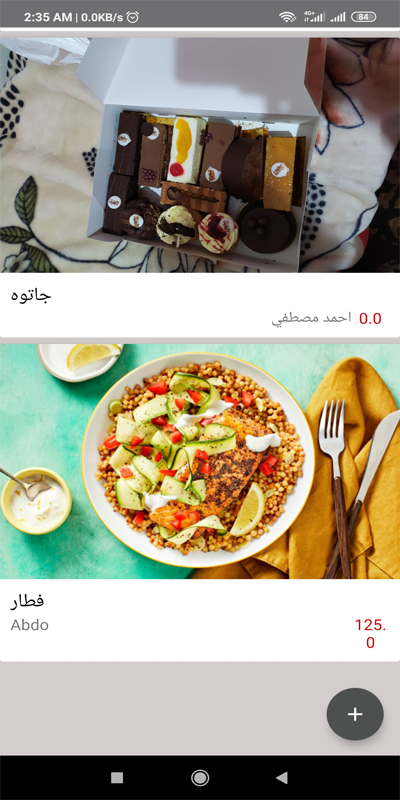
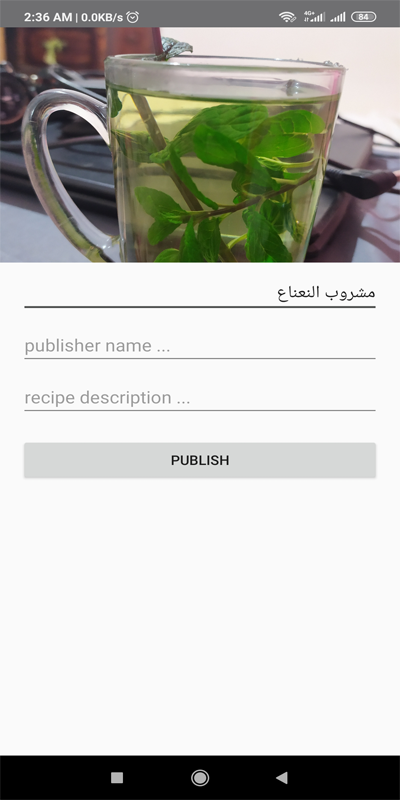

# MyRecipe

  
  
  
  

## Version 1.0
MVVM Pattern and Retrofit

## Technologies
1 - Java
 
2 - MySql Dataabase
 
7 - Retrofit
 
5 - RecyclerView and CardView
 
6 - Glide
 
7 - MVVM Designe Pattern
 

## New Features to Add

Suggest your new Ideas
